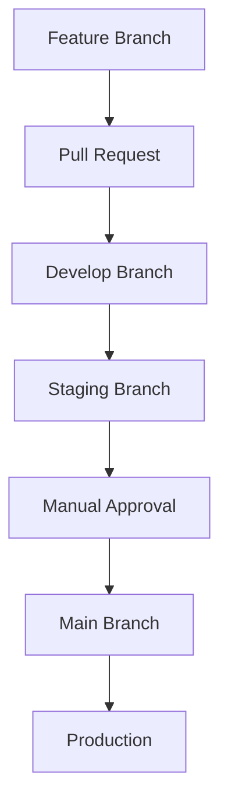

# 🚀 **RESUMEN PIPELINE JENKINS - DRONCAKES**

## 📁 **Archivos Jenkins Activos**
- ✅ **`Jenkinsfile`** - Pipeline principal (ACTIVO)
- 📦 **`Jenkinsfile.backup`** - Respaldo (mantener como backup)
- ❌ **`Jenkinsfile-Original`** - ELIMINADO ✓
- ❌ **`Jenkinsfile-Local`** - ELIMINADO ✓

---

## 🌿 **ESTRATEGIA DE RAMAS**

### **🟢 MAIN (Producción)**
```groovy
when: branch 'main'
```
**🔄 Pipeline:**
1. ✅ Unit Tests (Jest)
2. ✅ Integration Tests
3. ✅ ESLint Quality Check
4. ✅ Security Audit (npm audit)
5. ⏸️ **APROBACIÓN MANUAL REQUERIDA**
6. 🚀 Deploy to Production (puerto 3000)
7. 💨 Post-Deploy Health Check

**🎯 Entorno:** `https://droncakes.com`

### **🟡 STAGING (Testing)**
```groovy
when: branch 'staging'
```
**🔄 Pipeline:**
1. ✅ Unit Tests + Integration Tests
2. ✅ Quality Gate (obligatorio)
3. ✅ Security Audit
4. 🚀 Deploy automático a Staging (puerto 3002)
5. 💨 Health Check

**🎯 Entorno:** `staging.droncakes.com`

### **🔵 DEVELOP (Desarrollo)**
```groovy
when: branch 'develop'
```
**🔄 Pipeline:**
1. ✅ Unit Tests básicos
2. ✅ ESLint
3. 🚀 Deploy automático a Dev (puerto 3001)
4. ❌ Sin Quality Gate (ágil)

**🎯 Entorno:** `dev.droncakes.com`

### **🟣 FEATURE/* (Características)**
```groovy
when: branch 'feature/*'
```
**🔄 Pipeline:**
1. ✅ Unit Tests
2. ✅ ESLint
3. ✅ Security Audit
4. ❌ **NO DESPLIEGA** (solo validación)

---

## 🧪 **PRUEBAS UNITARIAS E INTEGRACIÓN**

### **📂 Estructura de Tests**
```
tests/
├── unit/                   # Jest Unit Tests
│   ├── droneService.test.js
│   └── orderService.test.js
└── integration/            # Integration Tests
    ├── api.test.js
    └── business-logic.test.js
```

### **🎯 Comandos de Testing**
```bash
# Unit Tests con cobertura
npm run test:unit

# Integration Tests
npm run test:integration

# Todos los tests
npm run test
```

### **📊 Reportes de Cobertura**
- **Ubicación:** `coverage/lcov-report/index.html`
- **Formato:** HTML + LCOV
- **Publicación:** Jenkins HTML Publisher Plugin

---

## ⚙️ **CONFIGURACIÓN JENKINS**

### **🔧 Tools Requeridas**
```groovy
tools {
    nodejs "Node18" // Debe coincidir con tu instalación
}
```

### **📋 Variables de Entorno**
```groovy
environment {
    PROJECT_NAME = "droncakes"
    BUILD_VERSION = "${env.BUILD_NUMBER ?: '1'}"
    CURRENT_BRANCH = "${env.BRANCH_NAME ?: 'main'}"
    DEPLOY_HOST = "${env.DEPLOY_HOST ?: 'localhost'}"
}
```

### **🎛️ Configuración Dinámica por Rama**
El pipeline detecta automáticamente la rama y configura:
- `DEPLOY_ENV` - Entorno de destino
- `QUALITY_GATE_REQUIRED` - Si requiere quality gate
- `E2E_TESTS_REQUIRED` - Si ejecuta tests E2E
- `APPROVAL_REQUIRED` - Si requiere aprobación manual

---

## 🔍 **CALIDAD Y SEGURIDAD**

### **🎯 ESLint (Análisis de Código)**
```bash
npm run lint:check  # Verificación
npm run lint:fix    # Auto-fix
```

### **🔒 Security Audit**
```bash
npm audit --audit-level=moderate
```

### **📈 Quality Gates (Staging & Main)**
- ✅ All tests passed
- ✅ Code coverage > threshold
- ✅ No critical security issues
- ✅ ESLint passed

---

## 🚀 **FLUJO DE DESPLIEGUE**



### **🎯 URLs por Entorno**
- **Development:** `dev.droncakes.com:3001`
- **Staging:** `staging.droncakes.com:3002`
- **Production:** `droncakes.com:3000`

---

## 📝 **COMANDOS ÚTILES**

### **🔧 Ejecutar Pipeline Localmente**
```bash
# Instalar dependencias
npm ci

# Ejecutar tests
npm run test:unit
npm run test:integration

# Verificar calidad
npm run lint:check
npm audit

# Build local
npm run build
```

### **🔍 Debug Jenkins**
```bash
# Ver logs del build
# En Jenkins: Build > Console Output

# Revisar artifacts
# Build > Archived Artifacts
```

---

## 🎊 **ESTADO ACTUAL**
- ✅ Pipeline funcionando correctamente
- ✅ Archivos duplicados eliminados
- ✅ Estrategia de ramas clara
- ✅ Tests unitarios e integración configurados
- ✅ Quality gates implementados
- ✅ Jenkins configurado y leyendo repositorio

**🎉 ¡Tu pipeline CI/CD está listo y optimizado!**